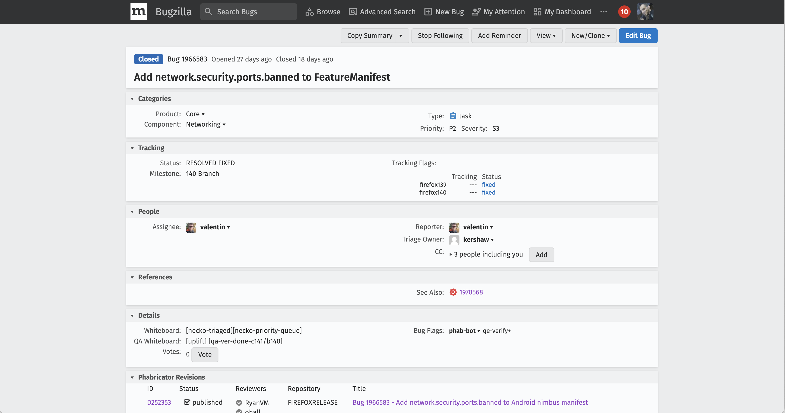
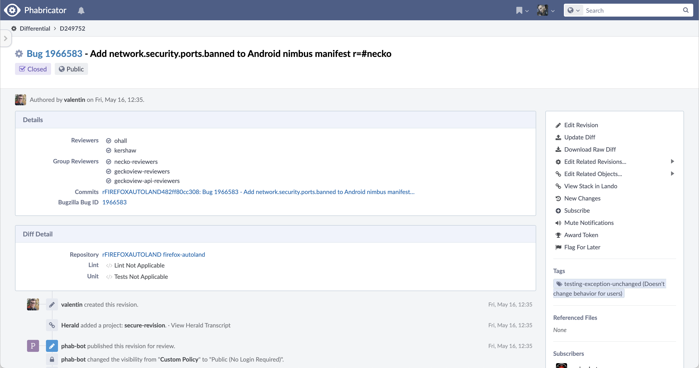
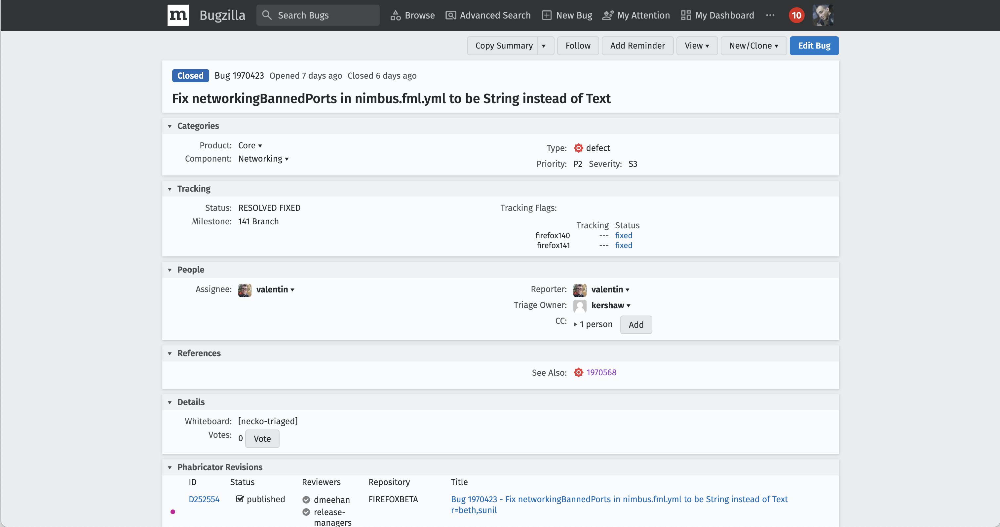
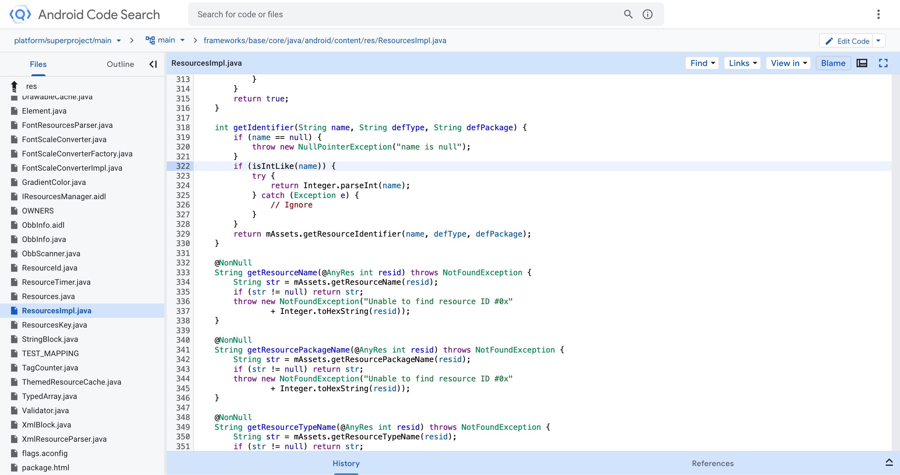
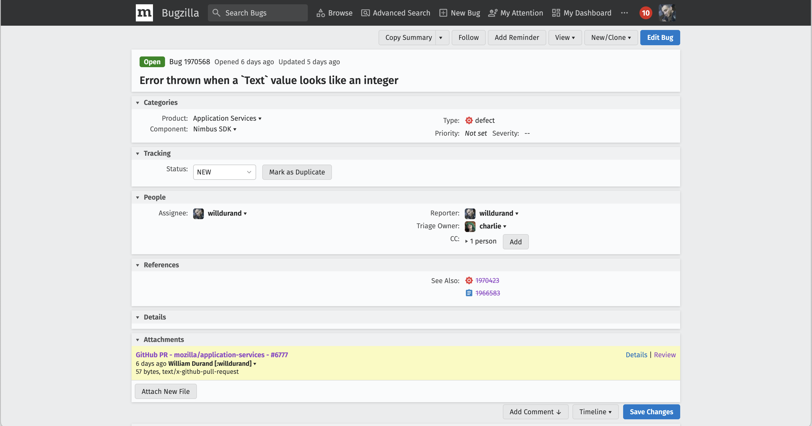
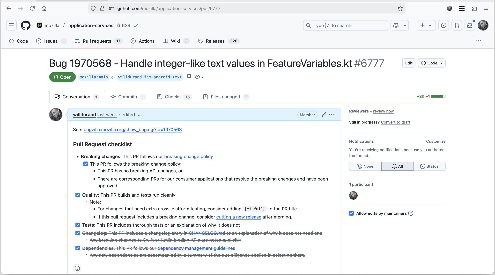
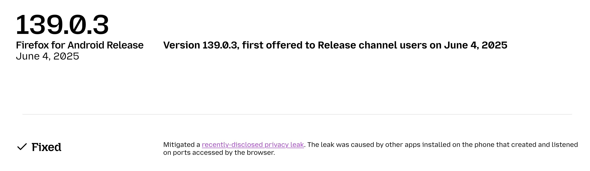

# Open Source

William Durand // 12 Juin 2025 🌈

---

## Qui suis-je ?

- Dans l'Open Source depuis 2010
- Michelin : thèse (DPPI), git
- Mozilla depuis fin 2017 (Sr. Staff Engineer)

---

## Mozilla

- Entreprise qui développe Firefox
- Des employé·e·s partout dans le monde
- Travail ouvert par défaut
- Licence :  _Mozilla Public License_ (MPL)

### Gouvernance

- Projet (historiquement) géré par les membres de la communauté, peu importe
  leur affiliation
- Gestion distribuée : modules, _module owners_, _peers_
- Tout changement de code doit être approuvé

### Contributeurs/Contributrices

- Font partie du projet
- Une immense chance
- Diversité

### Où trouver le code ?

- Sur GitHub
  - Un _monorepo_ ([mozilla-firefox/firefox](https://github.com/mozilla-firefox/firefox))
  - Beaucoup d'autres _repos_ (2500+ rien que pour [github.com/mozilla](https://github.com/mozilla))
  - 50+ organisations

<small class="with-margin">https://wiki.mozilla.org/GitHub</small>

### Comment on s'organise ?

- Gestion des _bugs_/suivi de projet :
    - Bugzilla
    - Jira
- Revue de code : Phabricator
- Outil de recherche : Searchfox

### Mon équipe

- Add-ons (extensions du navigateur)
- "Tout _bug_ a un lien avec les extensions"

---

## Il était une fois... ma semaine dernière

Un incident est déclaré sur le Slack interne suite à la publication de [Local
Mess](https://localmess.github.io/)

Couche réseau = Pas mon domaine

Une nouvelle fonctionnalité ajoutée quelques jours auparavant pourrait résoudre
ce problème de sécurité*

<small class="with-margin">* en attendant mieux</small>

<small>https://bugzilla.mozilla.org/show_bug.cgi?id=1966583</small>

<small>https://phabricator.services.mozilla.com/D249752</small>

Je teste en local... Firefox plante instantanément 😢

Je fais remonter à l'auteur du correctif et nous discutons avec les responsables
de ce module.

Décision est prise de changer la configuration.

<small>https://bugzilla.mozilla.org/show_bug.cgi?id=1970423</small>

Je trouve enfin la cause du plantage 😭

<small>https://cs.android.com/android/platform/superproject/main/+/main:frameworks/base/core/java/android/content/res/ResourcesImpl.java;l=322;drc=bf6b187a3ddc1a24098b099ba81659a7796c7a4d</small>

J'ouvre un _bug_.

<small>https://bugzilla.mozilla.org/show_bug.cgi?id=1970568</small>

J'attache également un correctif.

<small>https://github.com/mozilla/application-services/pull/6777</small>

### Et donc ?

### Flexibilité/Transparence

- Code source disponible
- Pas besoin de faire de demandes

### Fiabilité/Examen par les pairs

- Configuration corrigée pour éliminer tout risque
- Amélioration du code du _SDK_ pour la prochaine fois
- Échanges avec les personnes les plus compétentes

### Collaboration ouverte

- Tout est publique et vérifiable
- Aide supplémentaire toujours la bienvenue

<small class="with-margin">https://www.mozilla.org/en-US/firefox/android/139.0.3/releasenotes/</small>

---

## Challenges

- Travail ouvert
- Maintenance
  - Trier les _bugs_
  - Comprendre, reproduire

---

## Inner Source (selon moi)

- L'Open Source sans ses inconvénients
- Éviter de réinventer la roue
- Montée en compétence

---

## Merci.
